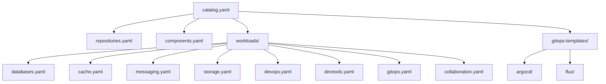

Welcome to the LoKO Workload Catalog - a curated collection of pre-configured Helm charts for [LoKO](https://getloko.github.io/) - your Local Kubernetes Oasis.

## 🎯 What is This?

The LoKO Catalog provides **ready-to-deploy workload definitions** for:

- **Databases**: PostgreSQL, MySQL, MongoDB, DynamoDB Local (with web UIs)
- **Cache**: Valkey, Memcached (with unified phpCacheAdmin UI)
- **Message Queues**: RabbitMQ, NATS, Redpanda, ElasticMQ (with web UIs)
- **Object Storage**: Garage (S3-compatible)
- **DevOps**: Forgejo, Forgejo Runner
- **DevTools**: Mock SMTP/SMS
- **GitOps**: ArgoCD, Flux Operator
- **Collaboration**: Excalidraw
- **GitOps Templates**: Jinja2 manifests for wiring ArgoCD/Flux to Forgejo repositories

Each workload is:

- ✅ **Pre-configured** for local development
- ✅ **Tested** with LoKO
- ✅ **Documented** with connection strings and health checks
- ✅ **Version-tracked** with Renovate automation

## 🚀 Quick Start

### Using LoKO CLI

```bash
# List available workloads
loko workloads info postgres

# Add and deploy
loko workloads add postgres --deploy

# Get connection details
loko workloads connect postgres
```

### Direct YAML Access

Fetch catalog files:

```bash
# Main catalog
curl https://raw.githubusercontent.com/getloko/catalog/main/catalog.yaml

# Specific category
curl https://raw.githubusercontent.com/getloko/catalog/main/workloads/databases.yaml
```

## 📦 Catalog Structure



## 🔍 Browse Workloads

### 🗄️ [Databases](workloads/databases)
PostgreSQL, MySQL, MongoDB, DynamoDB Local - Relational, NoSQL, and AWS-compatible databases with web UIs

### ⚡ [Cache & KV](workloads/cache)
Valkey, Memcached - In-memory caching with unified phpCacheAdmin UI

### 📧 [Message Queues](workloads/messaging)
RabbitMQ, NATS, Redpanda, ElasticMQ - Message brokers and AWS SQS-compatible queuing

### 📁 [Object Storage](workloads/storage)
Garage - S3-compatible distributed storage

### 🛠️ [DevOps & CI/CD](workloads/devops)
Forgejo, Forgejo Runner - Git hosting and CI/CD runners

### 🧪 [Dev & Testing Tools](workloads/devtools)
Mock SMTP/SMS - Email and SMS testing with web UI

### 🔄 [GitOps](workloads/gitops)
ArgoCD, Flux Operator - Continuous delivery automation

### 💬 [Collaboration](workloads/collaboration)
Excalidraw - Virtual whiteboard for diagrams

## 📊 Catalog Stats

- **Total Workloads**: 26 (19 services + 7 web UIs)
- **Helm Repositories**: 16
- **Categories**: 8
- **Internal Components**: 3 (Traefik, Zot, metrics-server)

## 🎨 Workload Definition Format

Each workload includes:

```yaml
workloads:
  postgres:
    type: system                              # system | user
    description: "PostgreSQL database"
    defaults:
      namespace: loko-workloads
      ports: [5432]
    chart:
      repo: groundhog2k
      name: groundhog2k/postgres
      version: "1.6.1"
    endpoints:
      - name: client
        protocol: tcp
        port: 5432
        host: "postgres.${LOKO_DOMAIN}"
    connections:
      default: "postgresql://postgres:${PASS}@${HOST}:5432/${DB}"
      jdbc: "jdbc:postgresql://${HOST}:5432/${DB}?user=postgres&password=${PASS}"
    secrets:
      - name: password
        type: password
        length: 16
        charset: alphanum
    health_checks:
      - type: tcp
        port: 5432
        tier: infrastructure
```

## 👤 User Workloads

For custom applications, LoKO supports **user workloads** where you provide your own Helm chart values directly. Unlike system workloads (which have pre-configured presets), user workloads require you to specify all Helm values.

### HTTP Service Example

```yaml
workloads:
  http-webhook:
    type: user
    description: HTTP service with Traefik ingress
    chart:
      repo: securecodebox  # From catalog repositories
      name: securecodebox/http-webhook
      version: "5.5.0"
    defaults:
      namespace: default
    values:
      # You provide ALL Helm values (no presets)
      ingress:
        enabled: true
        ingressClassName: traefik
        annotations:
          traefik.ingress.kubernetes.io/router.entrypoints: websecure
          traefik.ingress.kubernetes.io/router.tls: "true"
        hosts:
          - host: echo.${LOKO_APPS_DOMAIN}
            paths: [/]
        tls:
          - hosts:
              - echo.${LOKO_APPS_DOMAIN}
```

HTTP workloads use Traefik ingress for routing. No TCP port configuration needed.

### TCP Service Example

```yaml
workloads:
  tcp-echo:
    type: user
    description: TCP service requiring port exposure
    chart:
      repo: istio
      name: istio/tcp-echo-server
      version: "1.2.0"
    defaults:
      namespace: default
      ports: [9000]  # Dynamically routed via HAProxy tunnel
    values:
      service:
        type: ClusterIP
        ports:
          - port: 9000
            name: tcp
            protocol: TCP
```

TCP workloads require:

1. Port exposed via HAProxy tunnel (automatically updated when ports change)
2. DNS host record configuration
3. Traefik TCPIngressRoute for routing (automatically configured)

### Using External Repositories

If your chart is **not** from a catalog repository, add the Helm repository to your config:

```yaml
# loko.yaml
workloads:
  helm-repositories:
    - name: my-custom-repo
      url: https://my-charts.example.com/
```

Then reference it in your workload:

```yaml
workloads:
  my-app:
    chart:
      repo: my-custom-repo
      name: my-custom-repo/my-chart
      version: "1.0.0"
```

See [Helm Repositories](repositories) for the list of catalog repositories.

### Key Differences

| Feature | System Workloads | User Workloads |
|---------|------------------|----------------|
| **Presets** | Pre-configured values | You provide all values |
| **Secrets** | Auto-generated | You manage |
| **Configuration** | Simplified | Full Helm control |
| **Use Case** | Standard services | Custom applications |

## 🔗 Raw YAML Access

```bash
# Get main catalog
https://raw.githubusercontent.com/getloko/catalog/main/catalog.yaml

# Get databases
https://raw.githubusercontent.com/getloko/catalog/main/workloads/databases.yaml

# Get repositories
https://raw.githubusercontent.com/getloko/catalog/main/repositories.yaml
```

## 🤝 Contributing

Want to add a workload? See the [Contributing Guide](contributing).

### Quick Contribution

1. Fork the repository
2. Add your workload to the appropriate `workloads/*.yaml` file
3. Test with LoKO: `loko workloads deploy <your-workload>`
4. Submit a pull request

## 📄 Schema Reference

See [Schema Documentation](schema) for complete catalog format specification.

## 🔧 Validation

All YAML files are validated on pull requests:

```bash
# Install yamllint
pip install yamllint

# Validate catalog
yamllint catalog.yaml workloads/*.yaml
```

## 📚 Resources

- [LoKO Documentation](https://getloko.github.io/)
- [LoKO GitHub](https://github.com/getloko/loko)
- [PyPI Package](https://pypi.org/project/loko-k8s/)
- [Report Issues](https://github.com/getloko/loko/issues)

## 📦 Version

Current catalog version: **1.0.0**
