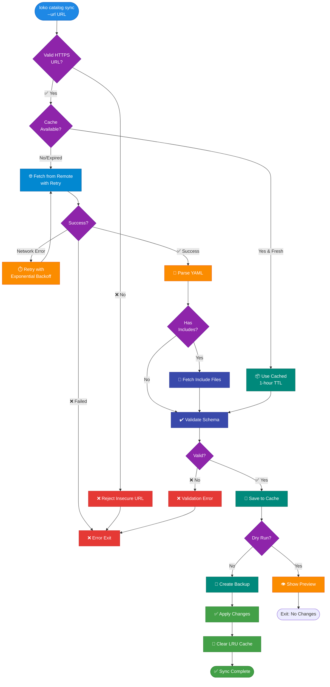

Sync catalogs from remote HTTPS URLs, enabling catalog updates independent of CLI releases.

## Overview

Remote catalog syncing allows you to:

- ✅ **Update catalogs without CLI upgrade** - Get new workloads independently
- ✅ **Use team catalogs** - Share centralized catalog across team
- ✅ **Test catalog changes** - Preview updates before merging
- ✅ **Community catalogs** - Use third-party workload collections

## Official Remote Catalog

**Repository**: [github.com/getloko/catalog](https://github.com/getloko/catalog)

**Catalog URL**: [getloko.github.io/catalog/catalog.yaml](https://getloko.github.io/catalog/catalog.yaml)

The official catalog is hosted on GitHub Pages and maintained in the [getloko/catalog](https://github.com/getloko/catalog) repository. It contains curated workload definitions, Helm repositories, and examples.

## Quick Start

```bash
# Sync from official GitHub catalog
loko catalog sync --url

# Or specify the URL explicitly
loko catalog sync --url https://getloko.github.io/catalog/catalog.yaml

# Sync from custom URL
loko catalog sync --url https://your-team.com/loko/catalog.yaml

# Preview changes first
loko catalog sync --url --dry-run

# Force fresh fetch (skip cache)
loko catalog sync --url --no-cache
```

## How It Works



## Features

### Security

**HTTPS-Only**:
```bash
# ✅ Allowed
loko catalog sync --url https://example.com/catalog.yaml

# ❌ Rejected
loko catalog sync --url http://example.com/catalog.yaml
# Error: Insecure URL rejected. Only HTTPS URLs are allowed for security
```

**Localhost Rejection**:
```bash
# ❌ Rejected
loko catalog sync --url https://localhost/catalog.yaml
loko catalog sync --url https://127.0.0.1/catalog.yaml
# Error: Local URLs not allowed for remote catalogs
```

### Caching

**1-Hour TTL**:
- Remote catalogs cached for 3600 seconds (1 hour)
- Cache location: `~/.loko/.cache/remote-catalogs/<sha256-hash>/`
- Automatic expiry after TTL
- Cache bypass available

**Cache Structure**:
```
~/.loko/.cache/remote-catalogs/
└── abc123def456.../                    # SHA256(URL) hash
    ├── catalog.yaml
    ├── repositories.yaml
    ├── workloads/
    │   ├── databases.yaml
    │   └── ...
    └── .metadata.json                  # Cache metadata
```

**Cache Metadata**:
```json
{
  "source_url": "https://example.com/catalog.yaml",
  "fetched_at": "2026-02-06T21:30:00+00:00",
  "expires_at": "2026-02-06T22:30:00+00:00",
  "ttl_seconds": 3600,
  "version": "1",
  "file_count": 12,
  "hash": "abc123...",
  "size_bytes": 45632
}
```

### Retry Logic

**Exponential Backoff**:
- Maximum 3 retry attempts
- Delay formula: `min(1.0 * (2^attempt) + random(0, 1), 10.0)` seconds
- Retries on network errors and 5xx HTTP errors
- No retry on 4xx client errors (404, 403, etc.)

**Example Retry Sequence**:
```
Attempt 1: Immediate
Attempt 2: ~1-2 seconds delay
Attempt 3: ~3-5 seconds delay
Failed: Error exit with helpful message
```

### Multi-File Support

**Automatic Include Resolution**:

Main catalog references other files:
```yaml
# catalog.yaml
version: "1"
includes:
  - repositories.yaml
  - workloads/databases.yaml
  - workloads/cache.yaml
```

**URL Resolution**:
```
Base URL: https://example.com/loko/catalog.yaml

Includes:
  repositories.yaml           → https://example.com/loko/repositories.yaml
  workloads/databases.yaml    → https://example.com/loko/workloads/databases.yaml
```

Uses `urllib.parse.urljoin()` for correct relative path resolution.

## Usage Examples

### Official GitHub Catalog

```bash
# Use default (GitHub catalog)
loko catalog sync --url

# Equivalent to
loko catalog sync --url https://getloko.github.io/catalog/catalog.yaml
```

### Team Catalog

```bash
# First sync (fetches from remote)
loko catalog sync --url https://team.example.com/loko-catalog.yaml

# Subsequent syncs within 1 hour (uses cache)
loko catalog sync --url https://team.example.com/loko-catalog.yaml
# ✓ Using cached catalog (fetched 30s ago)

# Force fresh fetch
loko catalog sync --url https://team.example.com/loko-catalog.yaml --no-cache
# ✓ Fetched from remote (cache bypassed)
```

### Testing Catalog Changes

```bash
# Test PR branch
loko catalog sync --url \
  https://raw.githubusercontent.com/user/loko/pr-branch/catalog.yaml \
  --dry-run

# Output:
# 🔍 Dry run - no changes will be made
#
# Changed files (3):
#   • catalog.yaml
#   • workloads/databases.yaml
#   • repositories.yaml
#
# ✓ Would sync 12 files
#   3 files have changes
#
# Run without --dry-run to apply changes
```

### Update to Latest

```bash
# Force update to latest version
loko catalog sync --force
```

## Command Reference

### Basic Sync

```bash
loko catalog sync --url [URL]
```

**Arguments**:
- `URL` - HTTPS URL to catalog.yaml (optional, defaults to GitHub catalog)

**Flags**:
- `--dry-run` - Preview changes without applying
- `--no-cache` - Skip cache, force fresh fetch
- `--force` - Force sync even if files identical
- `--no-diff` - Skip diff display before applying
- `--diff` - Show diff before applying (default)

### Examples

```bash
# Default (GitHub catalog)
loko catalog sync --url

# Custom URL
loko catalog sync --url https://example.com/catalog.yaml

# Preview first
loko catalog sync --url --dry-run

# Force fresh fetch
loko catalog sync --url --no-cache

# Skip diff, apply immediately
loko catalog sync --url --no-diff

# Combine flags
loko catalog sync --url https://example.com/catalog.yaml --dry-run --no-cache
```

## Error Handling

### Network Errors

```
❌ Failed to fetch remote catalog
   Error: Timeout fetching catalog from https://example.com/catalog.yaml
   URL: https://example.com/catalog.yaml
   Try: Check network connection or use --no-cache to retry
```

### HTTP 404

```
❌ Failed to fetch remote catalog
   Error: HTTP 404: Not Found
   URL: https://example.com/nonexistent.yaml
   Try: Verify the URL is correct
```

### Validation Errors

```
❌ Remote catalog validation failed
   Error: Missing required field 'version'
   The catalog may be corrupted or incompatible
```

### Insecure URLs

```
❌ Failed to fetch remote catalog
   Error: Insecure URL rejected: http://example.com/catalog.yaml
   Only HTTPS URLs are allowed for security
   Try: Use HTTPS URL instead of HTTP
```

## Best Practices

1. **Use Official Catalog**: Start with GitHub catalog for stability
2. **Preview Changes**: Always use `--dry-run` first when testing
3. **Cache Performance**: Let cache work (1-hour TTL is reasonable)
4. **Team Coordination**: Document your team's catalog URL
5. **Version Control**: Track catalog changes in git
6. **Test Before Deploying**: Use `--dry-run` on production systems
7. **Secure URLs**: Only use HTTPS from trusted sources
8. **Backup**: Automatic backups created before sync

## Troubleshooting

### Cache Issues

**Problem**: Old catalog being used

**Solution**:
```bash
# Force fresh fetch
loko catalog sync --url --no-cache

# Or clear cache manually
rm -rf ~/.loko/.cache/remote-catalogs/
```

### Network Timeouts

**Problem**: Slow/unreliable network

**Solution**:
- Check network connection
- Wait and retry (automatic exponential backoff)
- Use `--no-cache` to force retry

### Validation Failures

**Problem**: Catalog incompatible with CLI version

**Solution**:
```bash
# Force re-sync from remote
loko catalog sync --force --no-cache

# Check CLI version
loko version

# Upgrade CLI if needed
pip install --upgrade getloko
```

## See Also

- **[Catalog Overview](index)** - Catalog system overview
- **[CLI Reference](../../user-guide/cli-reference)** - All commands
