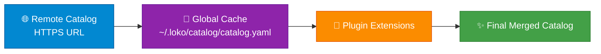
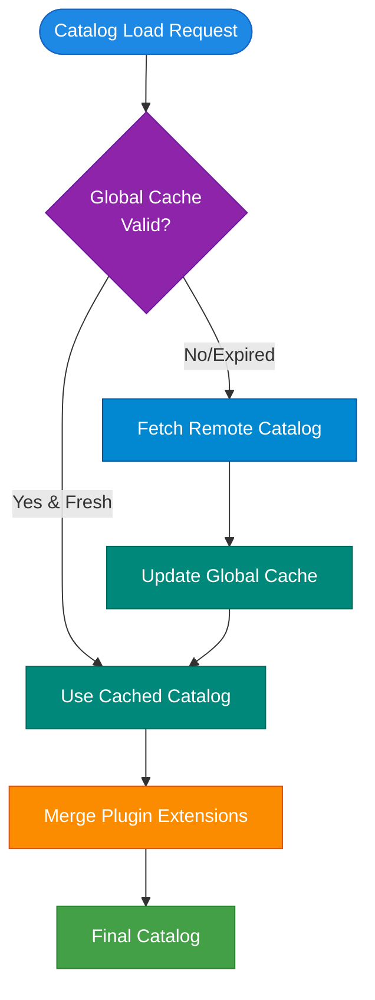

The LoKO Catalog provides a curated collection of pre-configured workload definitions for local Kubernetes development.

## Overview

The catalog system consists of:

- **Workload Definitions**: Pre-configured Helm charts for databases, caches, message queues, and more
- **Components**: Internal system components (dnsmasq, HAProxy, Traefik, metrics-server, Zot)
- **Helm Repositories**: Collection of Helm repository configurations
- **Secrets & Credentials**: Auto-generation specifications for workload credentials
- **Health Checks**: Built-in health check definitions
- **GitOps Templates**: Jinja2 manifests used to wire ArgoCD or Flux to a Forgejo repository during `loko gitops init`

## Catalog Sources

LoKO uses a remote catalog system for maximum flexibility:



### Remote Catalog

**Location**: Fetched from HTTPS URLs

**Official Catalog**:
- Repository: [github.com/getloko/catalog](https://github.com/getloko/catalog)
- URL: [getloko.github.io/catalog/catalog.yaml](https://getloko.github.io/catalog/catalog.yaml)

**Purpose**: Centralized catalog management with independent updates

**Benefits**:
- ✅ Get catalog updates without CLI upgrade
- ✅ Team collaboration (shared catalog URL)
- ✅ Test catalog changes before merging
- ✅ Use community catalogs

See [Remote Catalog Sync](remote-sync) for detailed usage.

### Global Cache

**Location**: `~/.loko/catalog/catalog.yaml`

**Purpose**: Local cache of remote catalog (1-hour TTL)

**When refreshed**:
- On first use
- After 1 hour cache expiration
- Manual sync with `loko catalog sync`

### Plugin Extensions

**Location**: Installed Python packages

**Purpose**: Extend catalog with custom workloads

**When to use**:
- Company-specific tools
- Custom integrations
- Community-contributed workloads

## Loading Priority



**Priority Order**:

1. **Global Cache** - Used if fresh (< 1 hour old)
2. **Remote Fetch** - Fetched if cache expired or missing
3. **Plugin Extensions** - Always merged on top

## Catalog Structure

The catalog is organized as multi-file YAML:

```
catalog/
├── catalog.yaml              # Main catalog file with includes
├── repositories.yaml         # Helm repository definitions
├── components.yaml           # System components (dnsmasq, HAProxy, etc.)
├── workloads/
│   ├── databases.yaml        # PostgreSQL, MySQL, MongoDB
│   ├── cache.yaml            # Valkey, Memcached
│   ├── messaging.yaml        # RabbitMQ, NATS, Redpanda
│   ├── storage.yaml          # Garage (S3-compatible)
│   ├── devops.yaml           # Forgejo, Forgejo Runner
│   ├── devtools.yaml         # Mock SMTP/SMS
│   ├── gitops.yaml           # ArgoCD, Flux Operator
│   └── collaboration.yaml    # Excalidraw
└── gitops-templates/         # Jinja2 manifests for GitOps wiring
    ├── argocd/               # ArgoCD Application, repo secret, webhook
    └── flux/                 # Flux GitRepository, Kustomization, receiver
```

### Main Catalog Format

```yaml
version: "1"
includes:
  - repositories.yaml
  - components.yaml
  - workloads/databases.yaml
  - workloads/cache.yaml
  - workloads/messaging.yaml
  # ... more includes
```

## Key Features

### 🌐 Remote-First

- Catalog hosted on GitHub Pages
- HTTPS-only for security
- Updates independent of CLI releases
- Team collaboration via shared URLs

### 🔒 Security

- HTTPS-only remote sources
- Localhost/file:// URLs rejected
- Secure file permissions (0700/0600)
- Pydantic schema validation

### ⚡ Performance

- In-memory LRU caching
- Remote catalog caching (1-hour TTL)
- Selective cache invalidation
- Fast startup times

### 🧩 Extensibility

- Plugin system for custom workloads
- Link-based workload relationships
- Template variable expansion
- Secret auto-generation

## Quick Commands

```bash
# View catalog information
loko catalog info

# List available workloads
loko catalog list
loko catalog list --category database

# Sync from remote (refreshes cache)
loko catalog sync
loko catalog sync --url https://example.com/catalog.yaml

# Force fresh fetch (bypass cache)
loko catalog sync --no-cache
```

## See Also

- [Remote Catalog Sync](remote-sync) - Detailed sync instructions
- [Components](components) - Internal components reference
- [Workloads Overview](workloads/index) - Available workloads
