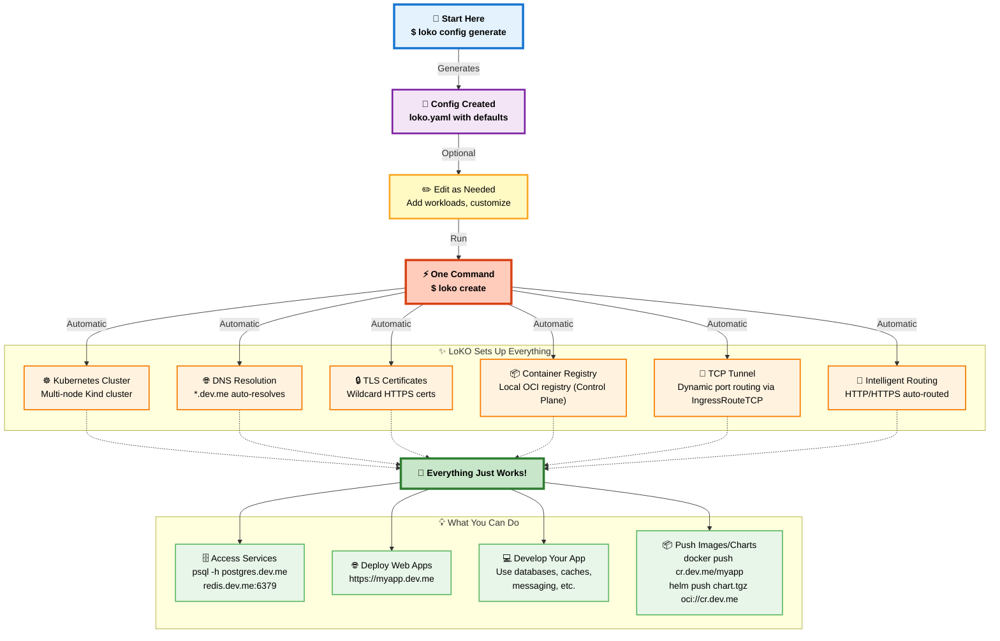
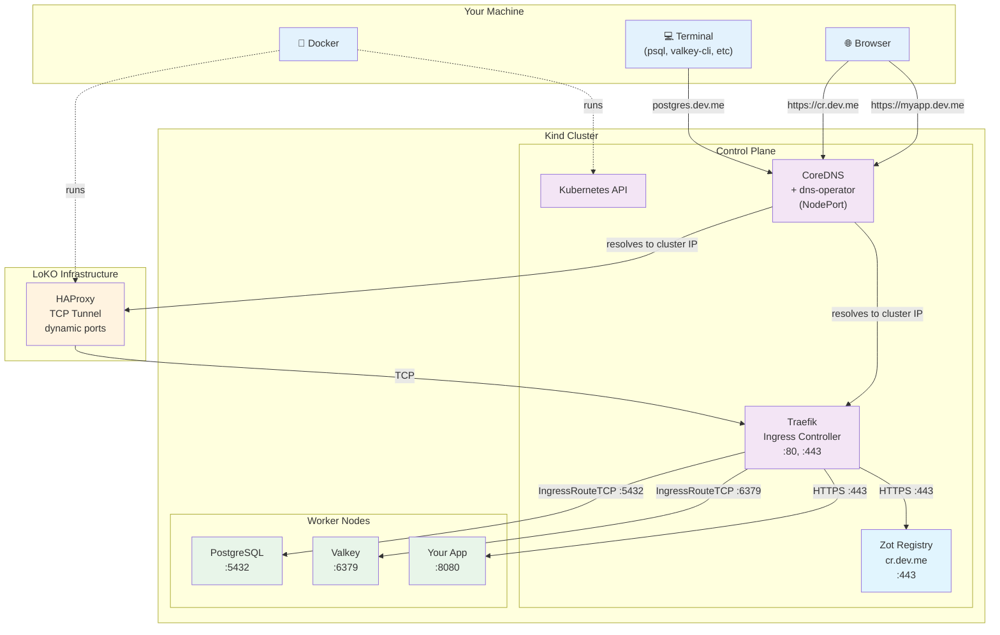

**Want to understand what happens when you run `loko create`?** This visual guide shows you exactly how LoKO transforms your simple config into a complete Kubernetes development environment.

---

## The Simple Story



**That's it.** LoKO automates everything between your config file and a working Kubernetes environment.

---

## What LoKO Sets Up

When you run `loko create`, here's what gets configured automatically:

### 🌐 DNS Resolution (CoreDNS + dns-operator)

**What**: In-cluster CoreDNS patched with a dynamic hosts plugin, managed by the dns-operator.

**Why it matters**:
- No editing `/etc/hosts` for every service
- Automatically updates when workloads are added or removed
- No host-side DNS process to manage or restart
- Works from browser, terminal, and inside cluster

**Result**: `postgres.dev.me`, `redis.dev.me`, `myapp.dev.me` all resolve instantly.

---

### 🔒 TLS Certificates (mkcert)

**What**: Wildcard SSL certificate trusted by your system.

**Why it matters**:
- HTTPS works in browsers with no warnings
- Docker trusts the registry
- Feels like production

**Result**: `https://myapp.dev.me` has a valid green padlock 🔒

---

### ☸️ Kubernetes Cluster (Kind)

**What**: Multi-node Kubernetes cluster running in Docker.

**Why it matters**:
- Real Kubernetes, not docker-compose pretending
- Test pod scheduling, affinity, multi-node scenarios
- Same API and behavior as production

**Result**: Actual Kubernetes with working Ingress and Services.

---

### 📦 Container Registry (Zot)

**What**: Local OCI registry at `cr.dev.me` running on control plane.

**Why it matters**:
- Push images locally, no Docker Hub rate limits
- Cache well-known images
- Push Helm charts as OCI artifacts
- Runs on control plane for cluster-wide access

**Result**: `docker push cr.dev.me/myapp:latest` works instantly.

---

### 🔌 TCP Tunnel (HAProxy)

**What**: Dynamic port routing for database connections via Traefik IngressRouteTCP.

**Why it matters**:
- Access PostgreSQL, MySQL, Redis from host
- Routes through Traefik's IngressRouteTCP to worker nodes
- No cluster recreation when adding workloads
- Automatic port management

**Result**: `psql -h postgres.dev.me` connects directly to worker nodes.

---

### 🚪 Intelligent Routing (Traefik)

**What**: Ingress controller that routes HTTP/HTTPS and TCP traffic.

**Why it matters**:
- Web apps get HTTPS automatically
- TCP workloads get dedicated routing
- Production-like traffic handling

**Result**: Everything just works - HTTP, HTTPS, and TCP.

---

## The Complete Infrastructure

Here's how all the pieces fit together:



### Traffic Flows

**HTTPS Request** (Browser → Web App):
```
Browser → DNS (resolves myapp.dev.me) → Traefik :443 → Your App (Worker Node)
```

**Container Registry** (Control Plane):
```
Browser → DNS (resolves cr.dev.me) → Traefik :443 → Zot Registry (Control Plane)
```

**TCP Database Connection** (Terminal → PostgreSQL):
```
Terminal → DNS (resolves postgres.dev.me) → HAProxy Tunnel → Traefik IngressRouteTCP → PostgreSQL (Worker Node)
```

**Internal Communication** (App → Database):
```
App Pod → CoreDNS → PostgreSQL Service → PostgreSQL Pod
```

---

## Why This Architecture?

### ✅ Separation of Concerns

Each tool does one thing well:
- **Kind**: Kubernetes cluster
- **CoreDNS + dns-operator**: In-cluster DNS resolution, dynamically updated
- **mkcert**: TLS certificates
- **HAProxy**: Dynamic TCP routing
- **Zot**: Container registry
- **Traefik**: Ingress and routing
- **LoKO**: Orchestrates everything

### ✅ Production Parity

- Real Ingress controller (Traefik)
- Real DNS resolution
- Real TLS termination
- Real Services and NetworkPolicies
- Multi-node clusters

**If it works in LoKO, it works in production.**

### ✅ Developer Experience

- No manual DNS configuration
- No certificate warnings
- No port conflicts
- No kubectl port-forward gymnastics
- **Just works.**

---

## Quick Reference

| Component | Purpose | Access |
|-----------|---------|--------|
| **DNS** | Resolve `*.dev.me` | Automatic |
| **TLS** | HTTPS certificates | `https://` URLs |
| **Kind** | Kubernetes cluster | `kubectl` |
| **Registry** | Container images | `cr.dev.me` |
| **Tunnel** | TCP port routing | Direct connections |
| **Traefik** | HTTP/HTTPS routing | Ingress resources |

---

**Ready to try it?** → [Quick Start Guide](../getting-started/quick-start)

**Want to customize?** → [Configuration Guide](../user-guide/configuration)
