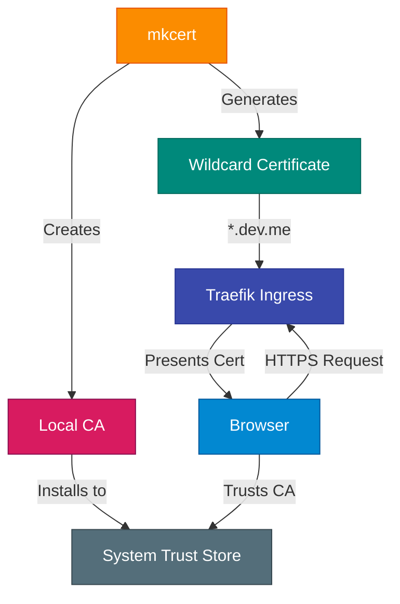
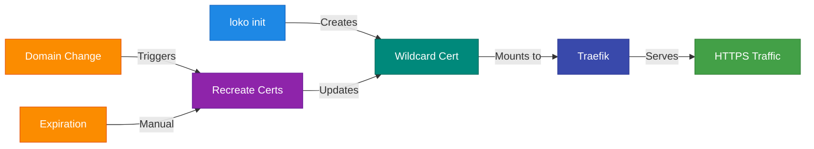

LoKO uses mkcert to create locally-trusted TLS certificates for HTTPS development.

## How It Works



## Certificate Setup

### Automatic Setup

Certificates are created automatically during environment creation:

```bash
loko env create
```

This command automatically:
1. Checks if mkcert CA exists (creates if needed)
2. Generates wildcard certificate for `*.${domain}`
3. Creates private key
4. Generates combined certificate file
5. Configures Traefik to use certificates

No manual certificate steps required!

### Manual Certificate Generation

```bash
loko init
```

### Certificate Location

```
.loko/<env-name>/certs/
├── rootCA.pem                    # Root CA certificate
├── <domain>.pem                  # Domain certificate
├── <domain>-key.pem              # Private key
└── <domain>-combined.pem         # Combined cert + key
```

Example for `dev.me`:
```
.loko/dev-me/certs/
├── rootCA.pem
├── dev.me.pem
├── dev.me-key.pem
└── dev.me-combined.pem
```

## Wildcard Certificates

LoKO creates a wildcard certificate covering:

- `*.dev.me` - All subdomains
- `*.pr.dev.me` - Preview environments
- `dev.me` - Base domain

This allows all services to use HTTPS:
- `https://postgres.dev.me`
- `https://myapp.dev.me`
- `https://myapp-pr-1.pr.dev.me`
- `https://cr.dev.me` (registry)

## Browser Trust

### macOS

mkcert automatically adds the CA to:
- **Keychain Access**: System keychain
- **Supported Browsers**: Chrome, Safari, Edge

**Firefox requires additional setup:**

Firefox uses its own certificate store (NSS), not the macOS Keychain.

```bash
# Install nss (required for Firefox)
brew install nss

# Reinstall mkcert CA to include Firefox
mkcert -install
```

If Firefox still shows certificate warnings:

1. Check nss is installed: `brew list nss`
2. Reinstall certificates: `mkcert -uninstall && mkcert -install`
3. Restart Firefox completely

### Linux

mkcert adds CA to:
- `/usr/local/share/ca-certificates/`
- NSS database (Firefox, Chrome)

For Firefox:
```bash
# Install libnss3-tools
sudo apt install libnss3-tools

# Reinstall mkcert CA
mkcert -install
```

### Verify Trust

```bash
# Check CA location
mkcert -CAROOT

# View CA certificate
cat "$(mkcert -CAROOT)/rootCA.pem"
```

## Certificate Operations

### Recreate Certificates

```bash
loko init
```

Useful when:
- Domain changed
- Certificates expired
- Trust store issues

### View Certificate Details

```bash
# View certificate info
openssl x509 -in .loko/dev-me/certs/dev.me.pem -noout -text

# Check expiration
openssl x509 -in .loko/dev-me/certs/dev.me.pem -noout -dates
```

### Test Certificate

```bash
# Test HTTPS endpoint
curl https://postgres.dev.me

# Show certificate details
curl -v https://postgres.dev.me 2>&1 | grep -i certificate
```

## Using Certificates

### In Traefik

Certificates are automatically loaded by Traefik:

```yaml
# helmfile.yaml (auto-generated)
traefik:
  additionalArguments:
    - --providers.file.filename=/tls/traefik-tls.yaml
  volumes:
    - name: tls
      mountPath: /tls
      type: hostPath
      hostPath: .loko/dev-me/certs
```

### In Application Pods

Mount certificates as secrets:

```yaml
apiVersion: v1
kind: Secret
metadata:
  name: tls-cert
type: kubernetes.io/tls
data:
  tls.crt: <base64-encoded-cert>
  tls.key: <base64-encoded-key>
```

```yaml
volumes:
  - name: tls
    secret:
      secretName: tls-cert
volumeMounts:
  - name: tls
    mountPath: /etc/tls
    readOnly: true
```

### In Docker Images

For building images that trust the CA:

```dockerfile
FROM ubuntu:22.04

# Copy CA certificate
COPY rootCA.pem /usr/local/share/ca-certificates/loko-ca.crt

# Update trust store
RUN update-ca-certificates
```

## Certificate Validity

### Default Validity

mkcert certificates are valid for:
- **Duration**: 10 years
- **Renewal**: Not automatic (recreate when expired)

### Check Expiration

```bash
# Check certificate dates
openssl x509 -in .loko/dev-me/certs/dev.me.pem -noout -dates
```

Output:
```
notBefore=Jan  1 00:00:00 2024 GMT
notAfter=Jan  1 00:00:00 2034 GMT
```

## Troubleshooting

### Browser Shows "Not Secure"

**Check CA is installed:**

```bash
# View CA root
mkcert -CAROOT

# Reinstall CA
mkcert -install
```

**macOS Keychain:**
1. Open Keychain Access
2. Search for "mkcert"
3. Double-click certificate
4. Expand "Trust"
5. Set "When using this certificate" to "Always Trust"

**Firefox:**
```bash
brew install nss
mkcert -install
```

### Certificate Not Found

```bash
# Check certificate exists
ls -la .loko/dev-me/certs/

# Regenerate certificates
loko init
```

### Wrong Domain in Certificate

```bash
# Check domain in config
yq '.environment.network.domain' loko.yaml

# Verify certificate domains
openssl x509 -in .loko/dev-me/certs/dev.me.pem -noout -text | grep DNS
```

Output should show:
```
DNS:*.dev.me, DNS:dev.me
```

### mkcert Not Found

```bash
# Install mkcert
brew install mkcert  # macOS

# Linux
curl -L https://github.com/FiloSottile/mkcert/releases/latest/download/mkcert-linux-amd64 -o mkcert
chmod +x mkcert
sudo mv mkcert /usr/local/bin/
```

### Traefik Not Using Certificates

```bash
# Check Traefik configuration
kubectl get configmap -n kube-system traefik-config -o yaml

# Check mounted volumes
kubectl describe pod -n kube-system -l app=traefik

# Restart Traefik
kubectl rollout restart deployment -n kube-system traefik
```

## Security Considerations

### CA Private Key

The mkcert CA private key is stored at:
```bash
$(mkcert -CAROOT)/rootCA-key.pem
```

:::caution[Keep CA Key Secure]
Anyone with this key can create trusted certificates for any domain on your system.
:::

**Best practices:**
- Don't commit CA keys to version control
- Don't share CA keys
- Regenerate if compromised: `mkcert -uninstall && mkcert -install`

### Certificate Scope

LoKO certificates are:
- ✅ Trusted locally on your machine
- ✅ Valid for all `*.${domain}` subdomains
- ❌ NOT trusted on other machines
- ❌ NOT valid for production use

### Git Ignore

CA keys are automatically git-ignored:

```txt
# .gitignore
.loko/*/certs/
```

## Advanced Usage

### Custom Certificate

To use your own certificate:

1. Place certificates in `.loko/<env>/certs/`:
   ```
   custom-cert.pem
   custom-key.pem
   ```

2. Update Traefik configuration
3. Recreate environment

### Multiple Domains

Generate certificates for multiple domains:

```bash
# Create additional certificate
cd .loko/dev-me/certs/
mkcert "*.example.local" "example.local"
```

Update Traefik to load both certificates.

### CA Certificate Export

Export CA for other machines:

```bash
# Find CA location
mkcert -CAROOT

# Copy CA certificate
cp "$(mkcert -CAROOT)/rootCA.pem" ~/Desktop/loko-ca.pem
```

On other machine:
```bash
# Import CA (macOS)
sudo security add-trusted-cert -d -r trustRoot \
  -k /Library/Keychains/System.keychain loko-ca.pem

# Import CA (Linux)
sudo cp loko-ca.pem /usr/local/share/ca-certificates/loko-ca.crt
sudo update-ca-certificates
```

:::caution
Only share the CA **certificate** (`rootCA.pem`), never the key (`rootCA-key.pem`).
:::

## Certificate Lifecycle



## Next Steps

- [Network & DNS](network-dns) - DNS configuration
- [Registry](registry) - Use HTTPS with registry
- [Troubleshooting](../reference/troubleshooting) - Certificate issues
