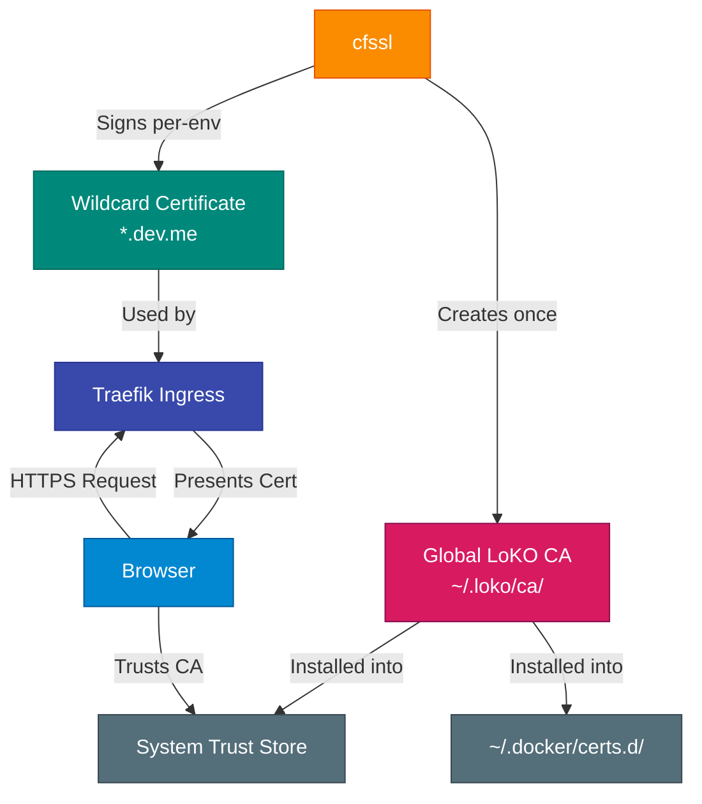

LoKO uses `cfssl` to generate a **single shared certificate authority** and per-environment wildcard TLS certificates for HTTPS development.

## How It Works



## Global CA vs Per-Environment Certificates

LoKO maintains a **single global CA** shared across all environments. This means:

- System trust (macOS Keychain, Linux trust store, NSS/Firefox, Java cacerts) is installed **once**, not once per environment
- You can run 100 environments with 100 different domains — each gets its own wildcard cert signed by the same trusted CA
- The CA is valid for **10 years**; per-environment wildcard certs are valid for 1 year

| Location | Contents |
|---|---|
| `~/.loko/ca/loko-ca.pem` | Global CA certificate (shared) |
| `~/.loko/ca/loko-ca-key.pem` | Global CA private key |
| `~/.loko/environments/<env>/certs/<domain>.pem` | Wildcard certificate |
| `~/.loko/environments/<env>/certs/<domain>-key.pem` | Wildcard private key |
| `~/.docker/certs.d/<registry-host>/ca.crt` | Docker registry trust |

## Certificate Setup

### Automatic Setup

Certificates are created automatically during environment creation:

```bash
loko env create
```

This command automatically:
1. Creates the global LoKO CA if it does not exist yet (stored in `~/.loko/ca/`)
2. Installs the global CA into the host trust store (macOS Keychain, Linux trust store, NSS, Java)
3. Configures Docker Desktop / Docker daemon to trust the CA for registry TLS
4. Generates a wildcard certificate for your configured domain, signed by the global CA
5. Configures Traefik to use the generated certificate

On subsequent environments, steps 1–3 are skipped since the CA already exists and is already trusted.

## Wildcard Coverage

LoKO generates certificates covering:

- `*.dev.me`
- `dev.me`
- `*.pr.dev.me` when GitOps preview environments are enabled
- workload-specific wildcard domains such as `*.garage.dev.me` when required

## CA Management (`loko certs ca`)

### Show CA info

```bash
loko certs ca status
```

Displays path, subject, expiry dates, and SHA-256 fingerprint of the global CA.

### Re-install CA trust

Useful when setting up on a new machine with an existing `~/.loko/ca/`, or when trust was accidentally removed:

```bash
loko certs ca install
```

Reinstalls the global CA into all trust stores and Docker certs.d.

### Remove CA

```bash
# Remove trust and delete CA files
loko certs ca remove

# Remove trust only, keep CA files
loko certs ca remove --keep-files
```

Removes the CA from all trust stores, cleans up `~/.docker/certs.d/` entries for all known environments, and (by default) deletes `~/.loko/ca/`.

### Regenerate CA

```bash
loko certs ca regenerate
```

Destroys the current CA, generates a fresh one, and reinstalls trust. All existing environment wildcard certs are invalidated — renew them afterwards:

```bash
loko certs renew
```

## Environment Certificate Management

### Show certificate info

```bash
loko certs show
```

Displays the wildcard cert for the current environment: SANs, expiry, issuer, fingerprint.

### Renew a wildcard certificate

```bash
loko certs renew
```

Regenerates the wildcard cert for the current environment using the existing global CA. Automatically updates the Kubernetes `wildcard-tls` secret and restarts Traefik.

## Browser and System Trust

### macOS

LoKO installs the global CA into the System Keychain automatically.

Firefox uses its own NSS store. Install `nss` first:

```bash
brew install nss
loko certs ca install
```

If Firefox still warns:
1. Confirm `nss` is installed
2. Run `loko certs ca install`
3. Restart Firefox fully

### Linux

LoKO detects and installs the CA into the appropriate trust store:

| Distro | Trust command |
|---|---|
| Debian / Ubuntu | `update-ca-certificates` |
| Fedora / RHEL / Rocky | `update-ca-trust` |
| Arch | `trust extract-compat` |
| openSUSE | `update-ca-certificates` |

For Firefox/NSS trust, install `certutil`:

```bash
# Debian/Ubuntu
sudo apt install libnss3-tools

# openSUSE
sudo zypper install mozilla-nss-tools
```

Then re-run:

```bash
loko certs ca install
```

## Verify Trust

```bash
# Show global CA
loko certs ca status

# Or directly with openssl
openssl x509 -in ~/.loko/ca/loko-ca.pem -noout -subject -issuer -dates

# Show env wildcard cert
loko certs show

# Test HTTPS
curl -v https://forgejo.dev.me
```

## Certificate Validity

| Certificate | Validity |
|---|---|
| Global CA | 10 years |
| Wildcard (per-env) | 1 year |

Check expiration:

```bash
# CA
openssl x509 -in ~/.loko/ca/loko-ca.pem -noout -dates

# Wildcard cert
openssl x509 -in ~/.loko/environments/dev-me/certs/dev.me.pem -noout -dates
```

## Troubleshooting

### Browser Shows "Not Secure"

Re-install CA trust:

```bash
loko certs ca install
```

Then verify:

```bash
openssl x509 -in ~/.loko/ca/loko-ca.pem -noout -subject
curl -v https://forgejo.dev.me
```

### Docker Push Fails with TLS Error

```
Get "https://cr.dev.me/v2/": tls: failed to verify certificate: x509: certificate signed by unknown authority
```

**On macOS**, Docker Desktop 4.x+ automatically trusts CAs installed in the macOS System Keychain — no `~/.docker/certs.d/` entry and no restart needed. LoKO installs the global CA into the System Keychain during `loko certs ca install` (or on first `loko env create`).

If pushes still fail after a fresh install, the Keychain installation may have been silently denied (sudo prompt dismissed). Re-run:

```bash
loko certs ca install
```

**On Linux**, LoKO writes to `/etc/docker/certs.d/` — no daemon restart is needed.

### Certificate Not Found

```bash
ls -la ~/.loko/environments/dev-me/certs/
loko certs renew
```

### Wrong Domain in Certificate

```bash
loko certs show
```

If SANs are missing, renew:

```bash
loko certs renew
```

### `cfssl` Not Found

```bash
# macOS
brew install cfssl

# Linux — install from distro packages or Cloudflare cfssl releases
```

### Git or curl Does Not Trust the LoKO CA

OS trust installation did not complete. Re-run:

```bash
loko certs ca install
```

## Security Notes

### CA Private Key

The global CA private key is stored at:

```
~/.loko/ca/loko-ca-key.pem
```

:::caution[Keep CA Key Secure]
Anyone with this key can mint certificates trusted by your machine after importing the matching CA.
:::

Best practices:
- Do not commit the CA key to version control
- Do not share the CA key
- Run `loko certs ca regenerate` if the key is compromised

### Trust Scope

LoKO certificates are:
- Trusted locally when CA installation succeeds
- Valid for your configured local development domains only
- Not suitable for production use

## Advanced Usage

### Share CA Across Machines

Export the CA certificate (never the key) and import it on another machine:

```bash
# Export
cp ~/.loko/ca/loko-ca.pem ~/Desktop/loko-ca.pem

# On the other machine — import into trust store manually, or:
# Copy ~/.loko/ca/ and run:
loko certs ca install
```

### In Docker Images

```dockerfile
FROM ubuntu:22.04

COPY loko-ca.pem /usr/local/share/ca-certificates/loko-ca.crt
RUN update-ca-certificates
```
