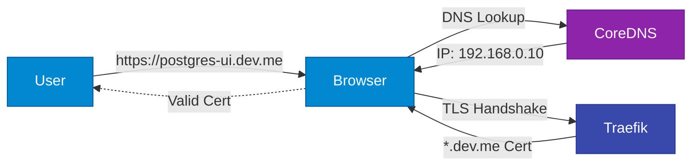

LoKO provides automatic DNS resolution for local development using in-cluster CoreDNS with a dnsmasq that dynamically tracks your workloads.

## How It Works


When you deploy a workload with an Ingress or IngressRoute, the dnsmasq automatically adds its hostname to CoreDNS — no restarts or manual configuration needed.

## DNS Configuration

### Default Setup

```yaml
network:
    ip: 192.168.0.10       # Auto-detected local IP
    domain: dev.me         # Base domain
```

If auto-detection picks the wrong address or is unavailable, generate your config with an explicit override:

```bash
loko config generate --local-ip 192.168.0.10
```

`dns-port` defaults to an auto-selected non-privileged host port (1024–32767), preferring 5453, and usually does not need manual changes.

### Custom Domain

```yaml
network:
    domain: myproject.local
```

All services will be accessible as:
- `postgres.myproject.local`
- `mysql.myproject.local`
- `cr.myproject.local` (registry)

## DNS Domains

### System Workloads

Format: `<workload>.<domain>`

Examples:
- `postgres.dev.me:5432`
- `mysql.dev.me:3306`
- `rabbitmq.dev.me:5672`

### User Workloads

Format: `<workload>.<domain>`

Example: `myapp.dev.me`

### Preview Workloads

Format: `<workload>-pr-<n>.pr.<domain>`

Example: `myapp-pr-1.pr.dev.me`

### Internal Components

- **Registry**: `cr.<domain>` (e.g., `cr.dev.me`)
- **Traefik Dashboard**: `traefik.<domain>` (if enabled)

## DNS Operations

### Check DNS Status

```bash
loko check dns
```

Shows:
- CoreDNS pod status
- Resolver configuration
- Resolution tests

### Start DNS

```bash
loko dns start
```

### Stop DNS

```bash
loko dns stop
```

### Recreate DNS

```bash
loko dns recreate
```

Useful when:
- DNS not resolving
- Configuration changed

## Resolver Configuration

### macOS

LoKO creates `/etc/resolver/<domain>`:

```
# cat /etc/resolver/dev.me
nameserver <kind-node-ip>
port <auto-selected-nodeport>
```

This routes all `*.dev.me` queries to the in-cluster CoreDNS via its auto-selected DNS port on the Kind node. No host-side DNS process is needed.

### Linux

LoKO configures the OS resolver backend when it can detect one it knows how to manage.

Currently documented Linux backends:
- `systemd-resolved`
- `NetworkManager` with its `dnsmasq` backend

Linux distributions that do not use `systemd-resolved` can still work if they use NetworkManager in this mode. Other Linux resolver stacks may still require manual configuration.

**Option 1: /etc/hosts (Simple)**

LoKO can automatically add entries to `/etc/hosts`:

```bash
# After environment creation
sudo loko init
```

**Option 2: systemd-resolved**

```bash
resolvectl query postgres.dev.me
```

**Option 3: NetworkManager**

```bash
nmcli general status
cat /etc/resolv.conf
```

When the NetworkManager backend is active, `/etc/resolv.conf` typically points to `127.0.0.1` and NetworkManager's local `dnsmasq` forwards your LoKO domain to the in-cluster dnsmasq host port.

## Testing DNS Resolution

### Using dig

```bash
# Test resolution
dig postgres.dev.me

# Should return your local IP
dig +short postgres.dev.me
# Output: 192.168.0.10
```

### Using nslookup

```bash
nslookup postgres.dev.me
```

### Using curl

```bash
# Test HTTP endpoint
curl http://traefik.dev.me

# Test HTTPS with cert
curl https://postgres.dev.me:5432
```

## Troubleshooting DNS

### DNS Not Resolving

```bash
# Check dnsmasq pod
kubectl get pods -n loko-components -l app.kubernetes.io/name=dnsmasq

# Check CoreDNS pods
kubectl get pods -n kube-system -l k8s-app=kube-dns

# Check dynamic hosts ConfigMap
kubectl get configmap loko-dynamic-hosts -n loko-components -o yaml

# Recreate DNS
loko dns recreate
```

### Port Conflicts

Since CoreDNS runs in-cluster, host port conflicts no longer apply to DNS itself. If you see resolver issues, check the Kind node IP is reachable:

```bash
# Check Kind node IP
kubectl get nodes -o wide
```

### Wrong IP Resolved

```bash
# Check configured IP
loko config ip

# Update config
vim loko.yaml  # Update network.ip

# Recreate DNS
loko dns recreate
```

## Network Ports

### Default Ports

| Service | Port | Purpose | Configurable |
|---------|------|---------|--------------|
| DNS | auto (prefers 5453) | dnsmasq host port | Auto-selected |
| HTTP | 80 | Traefik ingress | No |
| HTTPS | 443 | Traefik ingress | No |
| K8s API | 6443 | Kubernetes API | Yes (`api-port`) |

### Load Balancer Ports

```yaml
network:
    lb-ports:
      - 80
      - 443
      - 8080  # Additional port
```

### Port Conflicts

Check all ports before creating environment:

```bash
loko config port-check
```

## Accessing Services

### Via DNS

```bash
# PostgreSQL
psql -h postgres.dev.me -U postgres

# MySQL
mysql -h mysql.dev.me -u root -p

# HTTP service
curl http://myapp.dev.me
```

### Via Port Forward

When DNS isn't configured:

```bash
kubectl port-forward svc/postgres 5432:5432 -n common-services
psql -h localhost -p 5432 -U postgres
```

### Via Cluster IP (Internal)

From within the cluster:

```bash
kubectl run -it --rm debug --image=postgres:15 -- bash
psql -h postgres.common-services.svc.cluster.local
```

## Advanced Configuration

### Multiple Networks

```yaml
# loko-wifi.yaml
network:
    ip: 192.168.0.10
    domain: dev-wifi.me

# loko-ethernet.yaml
network:
    ip: 10.0.0.100
    domain: dev-eth.me
```

## Integration with Certificates

DNS and certificates work together:



## Next Steps

- [Certificates](certificates) - TLS certificate setup
- [Workload Management](workload-management) - Deploy services
- [Troubleshooting](../reference/troubleshooting) - Common DNS issues
