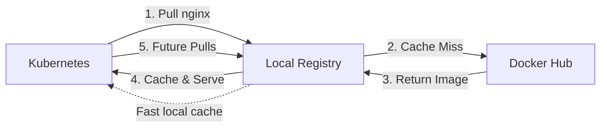

LoKO includes a built-in OCI container registry (Zot) for local image storage and mirroring.

## Registry URL

The registry is accessible at:

```
https://cr.${DOMAIN}
```

Example: `https://cr.dev.me`

## Basic Usage

### Push Images

```bash
# Tag image for local registry
docker tag myapp:latest cr.dev.me/myapp:latest

# Push to registry
docker push cr.dev.me/myapp:latest
```

### Pull Images

```bash
# Pull from registry
docker pull cr.dev.me/myapp:latest
```

### Use in Kubernetes

```yaml
apiVersion: apps/v1
kind: Deployment
metadata:
  name: myapp
spec:
  template:
    spec:
      containers:
        - name: myapp
          image: cr.dev.me/myapp:latest
```

No image pull secrets needed - registry runs in the cluster.

## Registry Configuration

### Basic Settings

```yaml
components:
  registry:
    enabled: true
    name: cr                    # Subdomain name
    # renovate: datasource=helm depName=zot repositoryUrl=http://zotregistry.dev/helm-charts
    version: "0.1.95"          # Zot version
    storage:
      size: 20Gi               # PVC size
```

### Storage Configuration

Default storage: 20Gi PersistentVolumeClaim

Adjust for your needs:
```yaml
storage:
  size: 50Gi    # Larger storage
```

## Registry Mirroring

Cache external registries locally for faster pulls:

```yaml
components:
  registry:
    enabled: true
    mirroring:
      enabled: true
      sources:
        - name: docker_hub
          enabled: true
        - name: quay
          enabled: true
        - name: ghcr
          enabled: true
        - name: k8s_registry
          enabled: true
        - name: mcr
          enabled: true
```

### How Mirroring Works



### Using Mirrored Images

Images are automatically cached when pulled:

```yaml
# In Kubernetes manifest
spec:
  containers:
    - name: nginx
      image: docker.io/library/nginx:latest
```

First pull: fetches from Docker Hub
Subsequent pulls: served from local cache

## Registry Operations

### Check Registry Status

```bash
loko registry status
```

Shows:
- Registry version
- Storage capacity
- Number of repositories
- Configuration

### List Repositories

```bash
loko registry list-repos
```

Output:
```
Local Repositories:
- myapp (2 tags)
- testimage (1 tag)

Mirrored Repositories:
- docker.io/library/nginx (3 tags)
- docker.io/library/postgres (2 tags)
```

### Show Repository Details

```bash
loko registry show-repo myapp
loko registry show-repo docker.io/library/nginx
```

### List Tags

```bash
loko registry list-tags myapp
```

Output:
```
Tags for myapp:
- latest
- v1.0.0
- v0.9.0
```

### Delete All Tags from a Repository

Remove all tags from a specific repository (marks manifests for garbage collection):

```bash
loko registry purge-repo myapp
loko registry purge-repo myapp --force   # skip confirmation
```

### Purge Entire Registry

Delete all tags from every repository in the registry:

```bash
loko registry purge
loko registry purge --force   # skip confirmation
```

:::caution
`purge` and `purge-repo` delete manifests via the OCI Distribution API. Actual disk space is freed after the registry runs garbage collection.
:::

### Load a Locally Built Image (Kind)

Load a locally built Docker image directly into the Kind cluster nodes without pushing to the registry:

```bash
# Load a single image
loko registry load-image myapp:latest

# Load multiple images at once
loko registry load-image myapp:latest myapp:v1.0.0

# Load into specific nodes only
loko registry load-image myapp:latest --nodes kind-worker
```

This calls `kind load docker-image` under the hood and is useful during development when you want to test a local build without a push/pull cycle.

## Building and Pushing

### Build and Push Workflow

```bash
# Build image
docker build -t myapp:v1.0.0 .

# Tag for registry
docker tag myapp:v1.0.0 cr.dev.me/myapp:v1.0.0
docker tag myapp:v1.0.0 cr.dev.me/myapp:latest

# Push to registry
docker push cr.dev.me/myapp:v1.0.0
docker push cr.dev.me/myapp:latest
```

### Multi-Arch Images

```bash
# Build multi-arch
docker buildx build --platform linux/amd64,linux/arm64 \
  -t cr.dev.me/myapp:latest \
  --push .
```

## Registry in CI/CD

### GitHub Actions

```yaml
name: Build and Push

on: push

jobs:
  build:
    runs-on: ubuntu-latest
    steps:
      - uses: actions/checkout@v4

      - name: Build and push
        run: |
          docker build -t cr.dev.me/myapp:${{ github.sha }} .
          docker push cr.dev.me/myapp:${{ github.sha }}
```

### Local Build Scripts

```bash
#!/bin/bash
# build-and-deploy.sh

VERSION=$(git rev-parse --short HEAD)
IMAGE="cr.dev.me/myapp:$VERSION"

# Build
docker build -t $IMAGE .

# Push
docker push $IMAGE

# Deploy
kubectl set image deployment/myapp myapp=$IMAGE
```

## Registry Authentication

### No Authentication Required

By default, the registry allows anonymous:
- ✅ Push
- ✅ Pull
- ✅ List

Suitable for local development.

### Enable Authentication (Advanced)

Edit registry configuration:

```yaml
# Custom values for registry
components:
  registry:
    values:
      httpAuth:
        enabled: true
        credentials:
          - user: admin
            password: secretpassword
```

Then configure Docker:

```bash
docker login cr.dev.me
```

## Registry as Build Cache

Use registry for Docker build cache:

```bash
# Build with cache from registry
docker build \
  --cache-from cr.dev.me/myapp:latest \
  -t cr.dev.me/myapp:new \
  .

# Push with cache
docker build \
  --cache-to type=registry,ref=cr.dev.me/myapp:buildcache \
  -t cr.dev.me/myapp:latest \
  .
```

## Registry Web UI

Zot includes a web interface:

```
https://cr.dev.me
```

Features:
- Browse repositories
- View tags
- Search images
- View image details
- Delete tags (if authentication enabled)

## Troubleshooting

### Push Fails with TLS Error

```bash
# Check certificate trust
docker info | grep -i insecure

# Verify registry certificate
curl -v https://cr.dev.me/v2/

# Recreate certificates
loko init
```

### Registry Not Accessible

```bash
# Check registry pod
kubectl get pods -n kube-system -l app=zot

# Check registry service
kubectl get svc -n kube-system zot

# Check registry logs
loko logs workload zot
```

### Disk Space Full

```bash
# Check registry storage
kubectl get pvc -n kube-system

# Increase storage size
vim loko.yaml
# Update components.registry.storage.size

# Recreate environment
loko env recreate
```

### Mirroring Not Working

```bash
# Verify mirroring config
yq '.environment.components.registry.mirroring' loko.yaml

# Check registry logs for errors
loko logs workload zot | grep -i mirror

# Test manual pull
docker pull cr.dev.me/docker.io/library/nginx:latest
```

### Cannot Pull from Registry in Kubernetes

```bash
# Check node containerd config
docker exec -it dev-me-worker cat /etc/containerd/config.toml

# Verify registry is in hosts.toml
docker exec -it dev-me-worker cat /etc/containerd/certs.d/cr.dev.me/hosts.toml

# Recreate cluster
loko env recreate
```

## Advanced Configuration

### Custom Registry Port

```yaml
components:
  registry:
    port: 5000    # Custom port
```

### Garbage Collection

Enable automatic garbage collection:

```yaml
components:
  registry:
    values:
      gc:
        enabled: true
        interval: "24h"
        deleteUntagged: true
```

### Storage Backend

Use different storage backend:

```yaml
components:
  registry:
    values:
      storage:
        type: s3
        s3:
          region: us-east-1
          bucket: my-registry-bucket
```

### Image Scanning

Enable vulnerability scanning:

```yaml
components:
  registry:
    values:
      extensions:
        search:
          enable: true
          cve:
            updateInterval: "24h"
```

## Registry Performance

### Cache Hit Rate

Monitor cache efficiency:

```bash
# Check mirrored repositories
loko registry list-repos | grep docker.io

# Compare with pulled images
kubectl get pods -A -o yaml | grep image:
```

### Storage Usage

```bash
# Check PVC usage
kubectl get pvc -n kube-system zot-storage

# Describe PVC for details
kubectl describe pvc -n kube-system zot-storage
```

## Best Practices

### ✅ Do

- Use semantic versioning for tags (`v1.0.0`)
- Tag with both version and `latest`
- Enable mirroring for frequently used images
- Monitor storage usage
- Clean up old tags regularly

### ❌ Don't

- Use `:latest` tag only (hard to track versions)
- Store large unused images (wastes space)
- Disable TLS verification (security risk)
- Forget to push after building

## Next Steps

- [Workload Management](workload-management) - Deploy applications
- [Certificates](certificates) - TLS certificate setup
- [Troubleshooting](../reference/troubleshooting) - Registry issues
